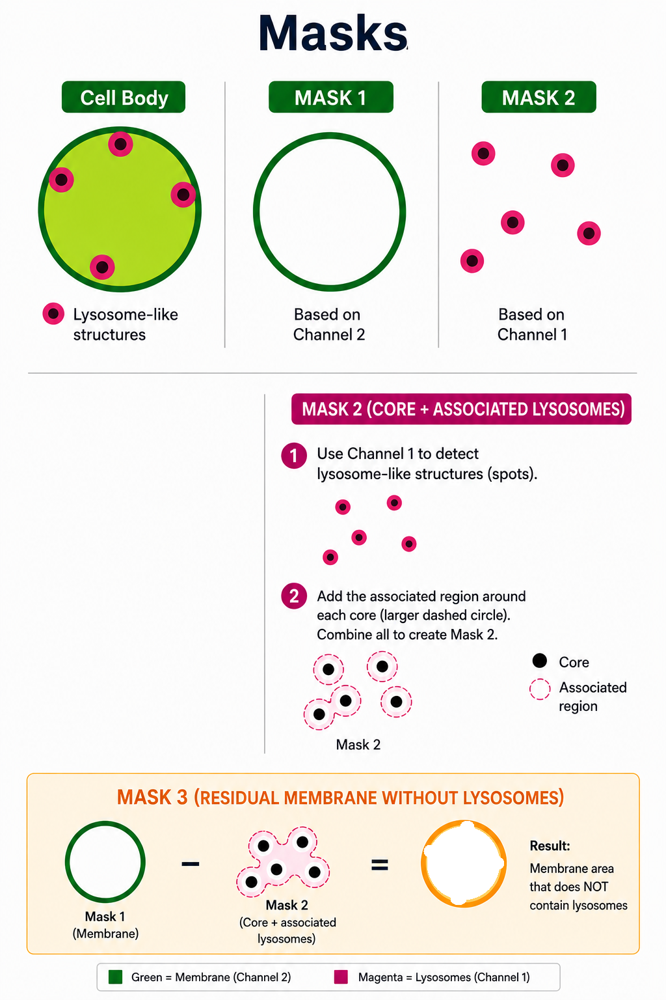

# Lysosomes-Detector-GUI
Interactive Python GUI for automated 3D lysosome detection, cell segmentation, signal quantification, and visualization from multichannel TIFF/CZI microscopy datasets. Includes Napari-based editing, per-cell analysis, video generation, and export of quantitative results.

The software provides an intuitive graphical interface for analyzing TIFF and Zeiss CZI image stacks, producing quantitative measurements, publication-quality visualizations, videos, and editable results through Napari.

---

## Features

- 🔬 Automatic 3D lysosome detection
- Cell segmentation using adaptive thresholding and watershed algorithms
- 📂 Supports TIFF and Zeiss CZI microscopy files
- 📏 Automatic extraction of voxel dimensions from image metadata
- 🖥️ User-friendly graphical interface (Tkinter)
- ✏️ Interactive Napari editor for manual correction of lysosomes
- 📊 Quantification of:
  - Lysosome diameter
  - Lysosome volume
  - Cell volume
  - Individual lysosome fluorescence
  - Total cellular fluorescence
  - Lysosome-associated fluorescence
  - Residual cytoplasmic fluorescence
  - Distance-dependent fluorescence distribution
  - Cell-by-cell statistics
- Automatic generation of:
  - CSV result tables
  - Overlay TIFF stacks
  - MP4/GIF videos
  - Debug images for quality control
-  Visualization of lysosome-cell relationships
- 📐 Diameter-based filtering of detected lysosomes
- 📈 Export of publication-ready quantitative datasets

---

# Supported Input Files

The program accepts:

- `.tif`
- `.tiff`
- `.czi`

Expected channels:

| Channel | Content |
|----------|---------|
| Channel 1 | Lysosome signal |
| Channel 2 | Cell signal |

If voxel dimensions are stored in the image metadata, they are read automatically. Otherwise, the GUI will request them.

---

# Workflow

The software performs the following pipeline:

1. Load microscopy image 3D
2. Read voxel metadata 3D
3. Detect lysosomes 3D
4. Estimate lysosome size 3D
5. Segment cells 3D
6. Assign lysosomes to cells
7. Quantify fluorescence and volume 3D
8. Generate overlays and videos
9. (Optional) Edit results interactively in Napari
10. Export all measurements

---

# Examples

You can access the images shown through [📄Zenodo](https://zenodo.org/records/22024614).

These examples cover the following workflow stages:

1. Load microscopy image 3D
2. Read voxel metadata 3D
3. Detect lysosomes 3D
4. Estimate lysosome size 3D
5. Segment cells 3D
6. Assign lysosomes to cells

<table>
  <tr>
    <td align="center">
      <br>
      <b>LARVA</b>
    </td>
    <td align="center">
      <br>
      <b>0 HOUR</b>
    </td>
    <td align="center">
      <br>
      <b>3 HOURS</b>
    </td>
  </tr>
</table>

## How do I obtain the diameter of lysosomes?

For a complete explanation of the method, click on the link below and obtain the explanatory document:
### Lysosome_Diameter_BlobLoG_FWHM.docx
It is located in the main directory of the directory

### [📄 Download the document](Lysosome_Diameter_BlobLoG_FWHM.docx)

<p align="center">
  
</p>

<p align="center">
  <b>Figure: Radial intensity profile 3D used to estimate lysosome diameter with the FWHM method.</b>
</p>

## Signal quantization 

### LysosomeS

SIGNAL LYSOSOMES = SIGNAL LYSOSOMES CORE + SIGNAL LYSOSOMES ASSOCIATED

SIGNAL LYSOSOMES CORE = X

LYSOSOMES CORE VOL = Vx

### SIGNAL LYSOSOMES CORE AVERAGE

A = X / Vx

### Membrane

SIGNAL ADJ MEMBRANE = SIGNAL MEMBRANA - SIGNAL LYSOSOMES 

SIGNAL ADJ MEMBRANE = M

ADJ MEMBRANE VOL = Vm

### SIGNAL MEMBRANE AVERAGE

B = M / Vm

### Signal intensity coefficient of lysosomes relative to the membrane

PIMI = (A-B)/(A+B)

PIMI = -1; 0% SIGNAL LYSOSOMES and 100% SIGNAL MEMBRANE

PIMI = 0; 50% SIGNAL LYSOSOMES and 50% SIGNAL MEMBRANE

PIMI = 1; 100% SIGNAL LYSOSOMES and 0% SIGNAL MEMBRANE

---
# Examples

These examples cover the following workflow stages:

7. Quantify fluorescence and volume 3D
8. Generate overlays and videos
9. (Optional) Edit results interactively in Napari
10. Export all measurements

<p align="center">
  
</p>

<p align="center">
  <b>Figure: Calculate MASKS.</b>
</p>

MASK 1: It represents the cell membrane.

MASK 2: It represents the core lysosomes + difussed lysosomes.

MASK 3: It represents the RESIDUAL CELL MEMBRANE without lysosomes.

MASK 3 = MASK 1 - MASK 2

CH 1: Channel 1(lysosomes)

CH 2: Channel 2(cell)

<table>
  <tr>
    <td align="center">
      <br>
      <b>CH 1 + CH 2</b>
    </td>
    <td align="center">
      <br>
      <b>MASK 1</b>
    </td>
  </tr>
</table>
<table>
  <tr>
    <td align="center">
      <br>
      <b>MASK 2</b>
    </td>
    <td align="center">
      <br>
      <b>MASK 3</b>
    </td>
  </tr>
</table>

---

# Main Outputs

The software generates quantitative tables including:

- Lysosome coordinates
- Lysosome diameter
- Lysosome volume
- Peak fluorescence intensity
- Cell assignment
- Cell volumes
- Cell fluorescence
- Lysosome-associated fluorescence
- Residual fluorescence
- Distance-based fluorescence analysis

All the datasets for each image are in the folder: ### [📄Datasets](https://github.com/Nahuel88Ar/GUI-LYSOSOMES/tree/main/OUTPUT%20FILES)


The next document contains a complete explanation of each dataset, its columns, and the meaning of each column: ### [📄 Download the document](Lysosome_Script_Datasets_and_Columns_Guide.docx)


Visualization outputs include:

- RGB overlay TIFF stacks
- MP4 videos
- GIF animations
- Debug segmentation masks

---

# Output Files

The software automatically generates:

- Lysosome coordinates
- Cell segmentation
- Cell assignments
- Lysosome statistics
- Cell statistics
- Fluorescence quantification
- Diameter statistics
- Overlay TIFF stacks
- MP4/GIF visualization videos
- Napari-editable lysosome tables
- Debug images for quality control

Outputs are exported as CSV, TIFF, and video files.

---
# Applications

This software is suitable for:

- Cell Biology
- Lysosome Biology
- Fluorescence Microscopy
- Confocal Microscopy
- High-content Imaging
- Quantitative Image Analysis
- 3D Microscopy Analysis

---

# Installation

## Requirements

The software was developed and tested using:

| Package | Version |
|---------|---------|
| Python | **3.12.13** |
| NumPy | 1.26.4 |
| Pandas | 2.2.3 |
| OpenCV | 4.12.0 |
| ImageIO | 2.33.1 |
| AICSImageIO | 4.14.0 |
| tifffile | 2023.2.28 |
| czifile | 2019.7.2.1 |
| scikit-image | 0.24.0 |
| SciPy | 1.11.4 |
| Napari | 0.6.4 |
| Magicgui | 0.10.1 |
| Matplotlib | 3.9.2 |
| PyQt6 | 6.11.0 |

---

## Clone the repository

```bash
git clone https://github.com/YourUsername/GUI-LYSOSOMES.git
cd GUI-LYSOSOMES
```

Alternatively, download the repository from GitHub as a ZIP file and extract it to a folder on your computer.

---

## Recommended Installation: Anaconda Navigator

The recommended way to run **GUI-LYSOSOMES** is to use **Anaconda Navigator** with a dedicated Python environment. This keeps the required Python packages isolated from other projects and makes it easier to install the correct dependencies and run the Jupyter Notebooks.

### 1. Install Anaconda

Download and install **Anaconda Distribution** for your operating system:

* [Download Anaconda Distribution](https://www.anaconda.com/download)
* [Official Anaconda Installation Guide](https://www.anaconda.com/docs/getting-started/anaconda/install)
* [Getting Started with Anaconda](https://www.anaconda.com/docs/getting-started/main)

Anaconda Distribution includes **Anaconda Navigator**, Python, conda, and Jupyter Notebook/JupyterLab.

### 2. Open Anaconda Navigator

After installing Anaconda, open **Anaconda Navigator** from your operating system.

Anaconda Navigator provides a graphical interface for:

* Creating and managing Python environments
* Installing packages
* Launching Jupyter Notebook or JupyterLab
* Selecting the environment used for a project

Official documentation:

* [Anaconda Navigator](https://www.anaconda.com/products/navigator)
* [Conda Environment Management](https://www.anaconda.com/guides/conda-environment-management)

### 3. Create a dedicated environment

Create a dedicated environment for **GUI-LYSOSOMES**.

In **Anaconda Navigator**:

1. Select **Environments** from the left-hand menu.
2. Click **Create**.
3. Enter the following environment name:

```text
Python 3.12 (myenv)
```

4. Select **Python 3.12**.
5. Click **Create**.

The software was developed and tested using **Python 3.12.13**.

Using a dedicated environment is recommended because it keeps the packages required by this project separate from other Python projects and from the default `base` environment.

Tutorial:

* [Conda Environment Management](https://www.anaconda.com/guides/conda-environment-management)

### 4. Install the required packages

The repository contains a **`requirements.txt`** file with all the Python packages required by the software.

After creating the `Python 3.12 (myenv)` environment:

1. Open **Anaconda Navigator**.
2. Go to **Environments**.
3. Select **`Python 3.12 (myenv)`**.
4. Click the **play/arrow icon** next to the environment.
5. Select **Open Terminal**.
6. In the terminal, make sure that the `Python 3.12 (myenv)` environment is active.
7. Navigate to the folder containing this repository.
8. Run:

```bash
pip install -r requirements.txt
```

This installs the required Python packages into the **`Python 3.12 (myenv)`** environment.

Tutorial:

* [Installing Packages with Conda](https://www.anaconda.com/docs/getting-started/working-with-conda/packages/install-packages)
* [Using pip in a Conda Environment](https://www.anaconda.com/docs/getting-started/working-with-conda/packages/pip-install)

> **Important:** Install the packages inside the `Python 3.12 (myenv)` environment. Do not install them into the default `base` environment.

### 5. Download or clone the repository

You can obtain the repository either by cloning it with Git or by downloading it directly from GitHub.

#### Option A — Clone the repository with Git

```bash
git clone https://github.com/YourUsername/GUI-LYSOSOMES.git
cd GUI-LYSOSOMES
```

#### Option B — Download the repository from GitHub

1. Open the GitHub repository.
2. Click **Code**.
3. Select **Download ZIP**.
4. Extract the ZIP file to a convenient location on your computer.

The repository should contain the following notebooks:

```text
GUI-LYSOSOMES/
│
├── SCRIPTS/L3_GUI.ipynb
├── SCRIPTS/NOT_L3_GUI.ipynb
├── requirements.txt
└── ...
```

### 6. Open the project environment and launch Jupyter

Once the environment has been created and the required packages have been installed:

1. Open **Anaconda Navigator**.
2. Select **Environments**.
3. Select the **`Python 3.12 (myenv)`** environment.
4. Go to the **Home** tab.
5. Make sure **`Python 3.12 (myenv)`** is selected as the active environment.
6. Locate **Jupyter Notebook** or **JupyterLab**.
7. Click **Launch**.

Jupyter will open in your web browser.

Official tutorials:

* [Getting Started with Anaconda](https://www.anaconda.com/docs/getting-started/main)
* [Working with Conda Environments](https://www.anaconda.com/docs/getting-started/working-with-conda/environments)

### 7. Open the GUI-LYSOSOMES repository

After Jupyter opens in your web browser:

1. Navigate to the location where you downloaded or cloned the repository.
2. Open the **`GUI-LYSOSOMES`** folder.
3. You should see the following two notebooks:

```text
L3_GUI.ipynb
NOT_L3_GUI.ipynb
```

### 8. Select the appropriate notebook

The repository contains **two different notebook versions**. Select the notebook according to the quality of your microscopy images.

#### `L3_GUI.ipynb`

Use **`L3_GUI.ipynb`** for images with:

* Lower image quality and clarity
* More noise
* A less-clear background
* More false-positive lysosome detections
* Greater need for erosion
* Greater use of morphological processing

This version is particularly recommended for **larval-stage images**, which generally contain more noise, a less-clear background, and more false-positive lysosome detections.

#### `NOT_L3_GUI.ipynb`

Use **`NOT_L3_GUI.ipynb`** for images with:

* Higher image quality and clarity
* Much less noise
* A clearer background
* Greater contrast between cells and the background
* Fewer false-positive lysosome detections
* Less need for erosion
* Less use of morphological processing

### 9. Run the notebook

Open the appropriate notebook:

```text
L3_GUI.ipynb
```

or:

```text
NOT_L3_GUI.ipynb
```

After opening the notebook:

1. Make sure the notebook is using the **`Python 3.12 (myenv)`** Python environment.
2. Run the notebook cells **from top to bottom**.
3. Follow the instructions provided in the notebook to load and process your microscopy images.

> **Important:** Do not use the default `base` environment. The notebook should use the **`Python 3.12 (myenv)`** environment where the required packages were installed.

### 10. Complete workflow

The complete installation and execution workflow is:

```text
Anaconda Navigator
        │
        ▼
Create Environment
        │
        ▼
Python 3.12 (myenv)
        │
        ▼
Install requirements.txt
        │
        ▼
Return to Home
        │
        ▼
Select lysosome-detector
        │
        ▼
Launch Jupyter Notebook / JupyterLab
        │
        ▼
Open GUI-LYSOSOMES/SCRIPTS
        │
        ├─────────────────────────┐
        ▼                         ▼
L3_GUI.ipynb              NOT_L3_GUI.ipynb
        │                         │
        ▼                         ▼
Lower-quality              Higher-quality
/noisier images             /clearer images
```

### Recommended Anaconda Tutorials

For users who are new to Anaconda, the following official tutorials are recommended:

* [Download Anaconda](https://www.anaconda.com/download)
* [Official Anaconda Installation Guide](https://www.anaconda.com/docs/getting-started/anaconda/install)
* [Getting Started with Anaconda](https://www.anaconda.com/docs/getting-started/main)
* [Conda Environment Management](https://www.anaconda.com/guides/conda-environment-management)
* [Installing Packages with Conda](https://www.anaconda.com/docs/getting-started/working-with-conda/packages/install-packages)
* [Using pip in a Conda Environment](https://www.anaconda.com/docs/getting-started/working-with-conda/packages/pip-install)
* [Anaconda Navigator](https://www.anaconda.com/products/navigator)

---

# Citation

If you use this software in your research, please cite this repository and the associated publication (when available).

---

# License

MIT License

Copyright (c) 2026 Nahuel88Ar

Permission is hereby granted, free of charge, to any person obtaining a copy
of this software and associated documentation files (the "Software"), to deal
in the Software without restriction, including without limitation the rights
to use, copy, modify, merge, publish, distribute, sublicense, and/or sell
copies of the Software, and to permit persons to whom the Software is
furnished to do so, subject to the following conditions:

The above copyright notice and this permission notice shall be included in all
copies or substantial portions of the Software.

THE SOFTWARE IS PROVIDED "AS IS", WITHOUT WARRANTY OF ANY KIND, EXPRESS OR
IMPLIED, INCLUDING BUT NOT LIMITED TO THE WARRANTIES OF MERCHANTABILITY,
FITNESS FOR A PARTICULAR PURPOSE AND NONINFRINGEMENT. IN NO EVENT SHALL THE
AUTHORS OR COPYRIGHT HOLDERS BE LIABLE FOR ANY CLAIM, DAMAGES OR OTHER
LIABILITY, WHETHER IN AN ACTION OF CONTRACT, TORT OR OTHERWISE, ARISING FROM,
OUT OF OR IN CONNECTION WITH THE SOFTWARE OR THE USE OR OTHER DEALINGS IN THE
SOFTWARE.

---

# Author

**Nahuel Hernan Ramos**

